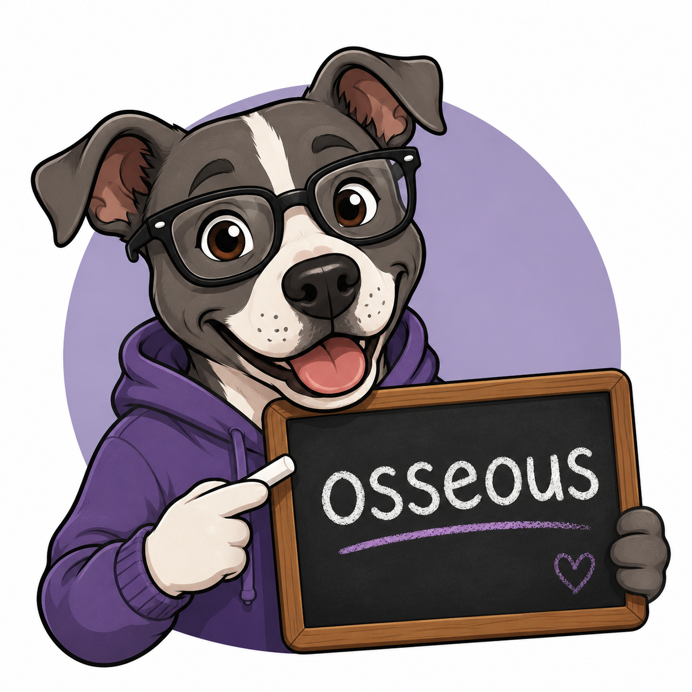

# 🐶 VocabuBaddie

  

  <strong>"Osseous? That's a bone-afide challenge."</strong>

A Streamlit vocabulary game that challenges players to identify the correct
definition of uncommon English words. Choose your difficulty, race against the
clock, and compete for a place on the leaderboard.

## Features

- Multiple-choice vocabulary game
- Three difficulty levels
- Time-based scoring
- SQLite leaderboard
- Wordset dictionary definitions
- Dynamic difficulty based on word frequency

## Acknowledgments

This project uses dictionary definitions from the **Wordset Dictionary** project and word frequency rankings from the **High Frequency Vocabulary** project.

* Wordset Dictionary: https://github.com/wordset/wordset-dictionary (CC BY-SA 4.0)
* High Frequency Vocabulary: https://github.com/arstgit/high-frequency-vocabulary (MIT License)

The vocabulary used by this application is a filtered and preprocessed dataset created for educational gameplay. See `ATTRIBUTION.md` for additional licensing and attribution information.

## About

VocabuBaddie was developed as part of Carnegie Mellon University's
17-636: *DevOps: Engineering for Secure Development and Deployment*.
The project demonstrates an AI-assisted, loop-engineering development workflow.